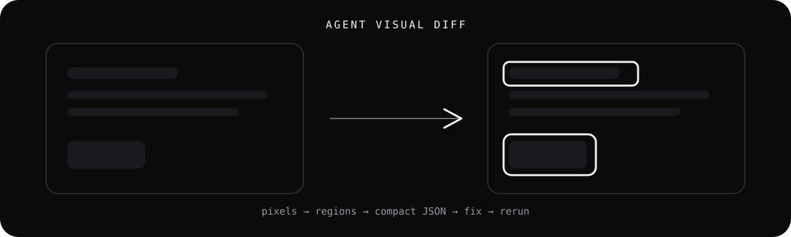

<p align="center">
  
</p>

<p align="center">
  Deterministic visual regression built for coding agents, CI, and humans.
</p>

<p align="center">
  <a href="https://github.com/lbframe/agent-visual-diff/actions/workflows/ci.yml"></a>
  <a href="LICENSE"></a>
  
  
</p>

`agent-visual-diff` compares two PNG screenshots, finds the pixels that changed, groups them into meaningful regions, and returns stable bounding boxes ranked by importance.

Instead of telling an agent only that a screenshot is “2.7% different”, it can say:

```text
#1  x=160 y=80   500x40   8,900px
#2  x=923 y=214  180x62   2,104px
#3  x=88  y=701  240x32   1,031px
```

The agent now knows exactly **where to look**.

## Why this exists

Most visual regression tools are designed around human review: a pass/fail verdict, a diff image, or an HTML report.

Coding agents need something slightly different:

- deterministic evidence
- compact machine-readable output
- ranked regions instead of a full-screen treasure hunt
- stable exit codes for loops and CI
- minimal dependencies and no hosted service

`agent-visual-diff` is intentionally small. It uses `pixelmatch` for pixel comparison and adds deterministic region extraction on top.

## Quick start

Requires Node.js 22+.

```bash
npm install
npm link

avd --help
```

Compare two screenshots:

```bash
avd compare reference.png actual.png \
  --diff .avd/diff.png \
  --out .avd/report.json
```

`compare` is optional:

```bash
avd reference.png actual.png --json
```

## Human output

```text
Match: 97.3000%
Diff pixels: 12,402 (2.7000%)
Regions: 3

#1  x=160 y=80   500x40   8900px
#2  x=923 y=214  180x62   2104px
#3  x=88  y=701  240x32   1031px

Report: .avd/report.json
Diff:   .avd/diff.png
```

## Agent output

Use `--json` for structured stdout:

```bash
avd compare reference.png actual.png --json
```

Use `--compact` when tokens matter:

```bash
avd compare reference.png actual.png --compact
```

Example region:

```json
{
  "id": 1,
  "x": 160,
  "y": 80,
  "w": 500,
  "h": 40,
  "px": 8900,
  "area": 20000,
  "density": 0.445,
  "shareOfDiff": 0.2543
}
```

An agent can inspect `x=160,y=80,w=500,h=40` first, fix the likely cause, recapture, and rerun.

See [the agent contract](docs/agent-contract.md) for the intended automation loop and field semantics.

## Ignore / mask regions

Some regions of a page are dynamic by design: marquees, carousels, `<canvas>`, count-up
statistics, rotating testimonials, auto-cycling accordions, clocks. Comparing two captures
honestly still reports them as differences, which buries the real ones.

`--mask` excludes a known set of rectangles from the comparison. Masked pixels are removed
from `diffPixels`, never counted in a region, and dropped from the `diffRatio` denominator.

```bash
avd compare reference.png actual.png \
  --mask .avd/mask.json
```

Mask file format — see [`examples/mask.json`](examples/mask.json):

```json
{
  "regions": [
    { "name": "testimonial-carousel", "x": 120, "y": 2100, "w": 1200, "h": 600 }
  ]
}
```

One-off zones can also be passed inline, repeatably:

```bash
avd compare reference.png actual.png \
  --ignore 120,2100,1200,600 \
  --ignore 0,7200,1440,400
```

`--mask` and `--ignore` combine: file regions first, then inline regions in the order given.

The report gains three fields, always present so the JSON shape never changes:

```json
{
  "ignoredRegions": [
    { "name": "testimonial-carousel", "x": 120, "y": 2100, "w": 1200, "h": 600 }
  ],
  "ignoredPixels": 720000,
  "evaluatedPixels": 12345678
}
```

`diffRatio` is `diffPixels / evaluatedPixels`, so a run that masks 5% of the page does not
report a lower ratio just because the page is smaller. In the diff PNG, excluded zones get a
20% gray wash and suppressed differences stay visible inside them as darker red. The JSON
remains the source of truth for exact coordinates.

Masks are viewport-scoped. Regions are validated and clamped to the image, and a region
entirely outside it is an error rather than a silent no-op, so a typo fails loudly instead of
quietly passing. The same validation applies whether a region arrives from `--mask`,
`--ignore`, or straight from the programmatic API, so on any successful run
`ignoredPixels + evaluatedPixels` always equals `width * height`.

Masking is only as honest as the mask. Keep zones tight around genuinely dynamic UI, and
never widen a mask just to make a run go green — the
[benchmark](bench/README.md) shows what a mask does to real defects when it does.

## Sensitivity presets

Six comparison options interact, and the defaults are tuned for a page that did not change. When
you *know* what kind of difference you are looking for, name it instead of tuning numbers by hand:

```bash
avd compare reference.png actual.png --preset balanced
```

| Preset | For | threshold | includeAA | minRegionPixels | maxRegions |
| --- | --- | ---: | :---: | ---: | ---: |
| `strict` | fidelity over noise — colour, spacing, background tone, static screenshots | 0.01 | true | 20 | 100 |
| `balanced` | the recommended general profile | 0.03 | true | 20 | 50 |
| `noisy` | captures with expected rendering variation — font AA, shadows, animation residue | 0.1 | true | 20 | 50 |

A preset only supplies defaults. **An explicit option always wins:**

```bash
avd compare a.png b.png --preset balanced --threshold 0.05   # threshold 0.05, everything else from balanced
```

```js
comparePngFiles({ expected, actual, preset: 'balanced', threshold: 0.05 })
```

Without `--preset` the comparison is exactly what it has always been — same settings, same bytes.
An unknown name is an error, not a silent fallback:

```console
$ avd compare a.png b.png --preset ultra
avd: unknown preset: "ultra" (expected one of: strict, balanced, noisy)
```

### Why the numbers are not the obvious ones

`threshold` is a squared YIQ distance, not a perceptual amount. pixelmatch compares
`0.5053 · Δ²` against `35215 · threshold²`, so a neutral grey change is only reported when
`Δ > 264 · threshold`. At the default `0.1` that is `Δ > 26.4`, which is why a deliberate 5/255
colour-token change and a 10/255 background tone are both invisible by default. Every preset value
here sits far below `0.1` for that reason, and `strict` needs `0.01` — not the `0.03` that looks
sensible — to see a 5/255 field at all.

`includeAA: true` is in **all three** presets, including `noisy`, which is the opposite of the
intuitive choice. With AA detection off, pixelmatch drops the anti-aliased pixels of a difference,
and a text defect survives only as fragments smaller than `minRegionPixels`. On the Duna capture,
`includeAA: false` with `minRegionPixels: 20` drops two verified real defects from 100% recall to
5–10% at *every* threshold tested. Turning antialiasing detection off does not reduce noise here; it
deletes real defects. Noise is controlled by `minRegionPixels` instead.

`mergeGap` and `regionPadding` are in no preset: no measured value of either improved any profile,
so pinning them would only freeze today's defaults under a name that claims they were chosen.

Every number above is produced by `npm run bench:presets`, and
[the benchmark write-up](bench/README.md#sensitivity-preset-benchmark) records the measurements
each one rests on. If you change a value, re-run it.

## Position shift detection

On a long page, one wrong section height moves everything below it. The content is correct; it
is just 95px lower than the reference. Plain pixel comparison cannot tell that apart from dozens
of unrelated defects, so an agent ends up "fixing" every region instead of the one thing that
broke.

`--detect-shifts` reports those runs separately. It is **off by default**: without the flag the
output is byte-for-byte what it always was.

```bash
avd compare reference.png actual.png --detect-shifts
```

```json
{
  "regions": [ "…unchanged…" ],
  "shifts": [
    {
      "id": 1,
      "type": "position-shift",
      "x": 0, "y": 2812, "w": 1440, "h": 899,
      "deltaX": 0, "deltaY": -58,
      "confidence": 0.8235,
      "windows": 4,
      "diffPixels": 1204371,
      "evaluatedSamples": 316440
    }
  ],
  "settings": { "threshold": 0.1, "detectShifts": true }
}
```

The point is aggregation. One shift usually covers dozens of diff regions, so the report can say
*"look for the section above y=2812 and compare its height"* instead of listing 40 things to fix.
`shifts` is a top-level array beside `regions` rather than entries inside it, because displaced
pixels did not change — `px`, `density` and `shareOfDiff` mean nothing for them, and folding them
into `regions` would break the invariant that `shareOfDiff` sums against `diffPixels`.

Only the option is exposed. The gates behind it were tuned against the benchmark, not guessed, and
none of the internals needed a flag; they remain available to programmatic callers through
`agent-visual-diff/shift`.

### It is deliberately reluctant

A false shift is worse than a missed one: it sends an agent after a layout cause that does not
exist. A run of content is only called a shift when one translation explains it decisively **and**
neighbouring windows agree on the same offset independently. Anything ambiguous stays an ordinary
pixel diff.

That conservatism is load-bearing, and measurably so. On the Stripe capture, a 100%-accurate pixel
comparison finds a large real heading defect at 17.4% mismatch — a flat region like that "matches"
at almost any offset, so a naive best-offset search confidently reports a shift that explains
nothing. Gate 5 is what rejects it: a flat region never produces two adjacent windows agreeing on
the same delta. The same gate is what keeps a repeated card grid from matching the wrong card.

Read a shift as evidence, never as proof. It states that content below a point moved together by a
constant amount. It does not say why, and the reported span is bounded by the evidence rather than
by the true extent of the movement. A shift never suppresses a diff region and never grants a pass:
`--fail-above` still fails on `diffRatio`.

Full contract, including when to distrust a shift and the `schemaVersion` decision, in
[`docs/agent-contract.md`](docs/agent-contract.md). Measured behaviour, including the cases where
it declines to answer, in [`bench/README.md`](bench/README.md).

## CI mode

Fail when the changed-pixel ratio exceeds a threshold:

```bash
avd compare reference.png actual.png \
  --json \
  --fail-above 0.01
```

Exit codes:

| Code | Meaning |
| ---: | --- |
| `0` | Comparison completed and threshold passed |
| `1` | Usage or runtime error |
| `2` | Comparison completed but `--fail-above` failed |

JSON is still emitted on exit code `2`, so the failed run keeps its evidence.

## CLI options

```text
--json
--compact
--out <report.json>
--diff <diff.png>
--section <name>
--preset <name>
--threshold <0..1>
--include-aa
--min-region-pixels <n>
--merge-gap <px>
--region-padding <px>
--max-regions <n>
--mask <file.json>
--ignore <x,y,w,h>
--detect-shifts
--fail-above <ratio>
-h, --help
-v, --version
```

## How regions are built

1. Run `pixelmatch` with `diffMask: true`.
2. Convert the alpha channel to a binary diff mask.
3. Zero out every pixel covered by a mask region.
4. Run deterministic 8-neighbour connected-component labelling.
5. Drop components smaller than `minRegionPixels`.
6. Merge boxes whose x/y separation is within `mergeGap`.
7. Apply `regionPadding` and clamp to the viewport.
8. Sort by changed pixels descending, then y/x for stable ties.

`px` is the number of changed pixels represented by a region. `area` is the final bounding-box area and may include padding or unchanged pixels inside the rectangle.

### How a position shift is decided

Only when `--detect-shifts` is passed, and on the diff mask from step 3, so masks are honoured for
free:

1. Count differing pixels per row, and group active rows into bands. Deciding *where* to look costs
   no image reads at all.
2. Split each band into windows of at most 400 rows, but never fewer than two, so a short displaced
   section can still reach consensus.
3. Skip a window whose content already matches in place above 95%: nothing to explain, and this is
   the exit most windows on a long page take.
4. For each window, sweep the vertical lag on a coarse stride to find the basin, then re-measure
   every integer lag around it. Search the horizontal axis as a residual at that vertical delta, so
   a diagonal displacement is judged as one translation.
5. Apply five gates: the content must fail in place, translation must explain at least 85% of it and
   beat it by a decisive margin, the best lag must be a single prominent interior peak, and
   neighbouring windows must independently agree on the same delta.
6. Fuse agreeing windows into a run, and join runs that agree across a small gap.

Cost is bounded by construction: a coarse stride of 4 over ±200px, a fine sweep of ±8px, and at most
64 bands. The search is linear in `maxShift`, not in image area, and the per-window work is
proportional to the window's height. On the 1440×9319 Duna capture, shift detection adds roughly
3.5s on top of a comparison that already takes ~4s — which is why it is opt-in.

## Programmatic API

```js
import { comparePngFiles } from 'agent-visual-diff';

const report = comparePngFiles({
  expected: 'reference.png',
  actual: 'actual.png',
  diffPng: '.avd/diff.png',
  section: 'homepage',
  preset: 'balanced',
  threshold: 0.1,
  minRegionPixels: 3,
  mergeGap: 6,
  regionPadding: 4,
  mask: [{ name: 'testimonial-carousel', x: 120, y: 2100, w: 1200, h: 600 }],
  ignore: [{ name: 'inline-1', x: 0, y: 7200, w: 1440, h: 400 }],
  detectShifts: true
});
```

`preset` is one of `strict`, `balanced` or `noisy`; anything else throws. Every comparison option
you pass wins over the preset's value, and any option you leave out falls back to the preset, and
then to the default. `preset` defaults to `null`, which resolves to the v0.1 defaults.

`detectShifts` defaults to `false`. Omit it — or pass `false` — and the report is identical to
what this API produced before the option existed: neither `shifts` nor `settings.detectShifts`
appears, so treat `shifts` as present if and only if `settings.detectShifts` is `true`. The same
holds for `preset`: a top-level `preset` key appears if and only if a preset was requested, and
`settings` always carries the values that actually ran.

Preset names and their resolved values are also exported from `agent-visual-diff/presets`.

Region primitives are also exported from `agent-visual-diff/regions`, mask helpers
(`readMaskFile`, `parseIgnoreSpec`, `clampRegions`, `buildIgnoreMask`) from `agent-visual-diff/mask`,
and the shift detector itself from `agent-visual-diff/shift` for callers who need to bound a
pathological page.

## Playwright

A minimal integration lives in [`examples/playwright-snippet.mjs`](examples/playwright-snippet.mjs).

The comparator is deterministic for identical PNG inputs and settings. Browser capture itself may not be. Fix the viewport, fonts, animations, dates, random data, dynamic content, and browser/runtime versions when reproducibility matters.

## Supported Node.js versions

Supported:

- Node.js 22 LTS
- Node.js 24 LTS

Also tested:

- Node.js 26 Current

`agent-visual-diff` supports non-EOL Node.js versions relevant to production use. The minimum
supported major is currently Node 22. CI also tests the latest Current release to catch
forward-compatibility issues early; Current is a signal, not a support commitment. The LTS lines
are what the project stands behind.

## Development

```bash
npm install
npm test
npm run check
npm run bench
npm run bench:shifts
npm run pack:dry
```

`npm run bench` replays the mask benchmark against real page captures. `npm run bench:shifts`
replays the position shift benchmark: eight generated cases with known answers, then the Duna,
Stripe and Apple captures. Both exit non-zero on failure. See
[bench/README.md](bench/README.md) for the fixtures and the recorded numbers.

Test the exact package artifact before publishing:

```bash
npm pack
mkdir /tmp/avd-smoke && cd /tmp/avd-smoke
npm init -y
npm install /path/to/agent-visual-diff/agent-visual-diff-0.1.0.tgz
./node_modules/.bin/avd --help
```

## Publishing

Check package availability and authentication:

```bash
npm view agent-visual-diff
npm whoami
```

Then publish:

```bash
npm publish --access public
```

After publication:

```bash
npx agent-visual-diff compare reference.png actual.png --json
```

## Scope

This project does **not** attempt to infer why a visual change happened or whether a design is aesthetically correct. It produces deterministic visual evidence so another system, agent, or human can make that judgment.

## Contributing

Issues and focused pull requests are welcome. Read [CONTRIBUTING.md](CONTRIBUTING.md) before contributing.

Security reports should follow [SECURITY.md](SECURITY.md).

## License

MIT © LB FRAME
